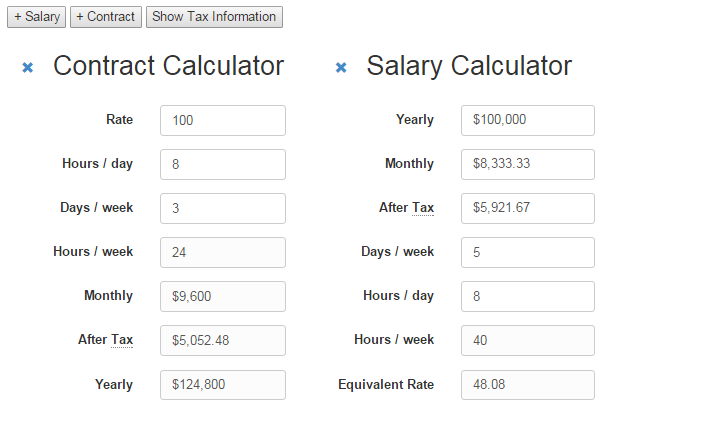

Income Comparer
---------------

Quickly calculate and compare income between salary and hourly, number of days
per week, and how many hours per day. Get a more accurate income prediction
based on your personal needs, or use to compare value during a negotiation.

[See it in action](http://joeyespo.com/income-comparer).

#### Disclaimer

I am not a tax consultant.
Be sure to do your own research and adjust your tax information!

Screenshot
----------

Contributing
------------

1. Check the open issues or open a new issue to start a discussion around
   your feature idea or the bug you found
2. Fork the repository and make your changes
3. Send a pull request

If your PR has been waiting a while, feel free to [ping me on Twitter](http://twitter.com/joeyespo).
